<!-- ╔══════════════════════════════════════════════════════════════════╗ -->
<!-- ║                       STEPHEN SOOKRA · README                    ║ -->
<!-- ║       AI/ML · XR Dojo · Hackathon Builder · Future Founder       ║ -->
<!-- ╚══════════════════════════════════════════════════════════════════╝ -->

<!-- ─────────────────────────  HERO BANNER  ───────────────────────── -->
<!-- Hand-coded animated SVG: drifting particles, breathing glow, gradient wipe, typewriter subtitle, neural-net constellation -->
<a href="https://github.com/StephenSook">
  
</a>

<!-- ─────────────────────  ANIMATED TYPING TAGLINE  ───────────────── -->
<div align="center">
  <a href="https://stephensookra.com">
    
  </a>
</div>

<!-- ─────────────────────────  STATUS BADGES  ─────────────────────── -->
<div align="center">
  
  
  <a href="https://stephensookra.com"></a>
</div>

<br/>

<!-- ════════════════════════  DIVIDER  ════════════════════════ -->


<!-- ───────────────────────────  ABOUT  ────────────────────────────── -->
<div id="about"></div>

<div id="user-content-toc">
  <ul align="center" style="list-style: none;">
    <summary>
      <h2 style="display: inline-block;">About Me</h2>
    </summary>
  </ul>
</div>

```yaml
name:       Stephen Sookra
role:       Software Engineer Intern @ XR Dojo
education:  Kennesaw State University · CS · AI/ML Concentration · 3.8 GPA · '28
building:   ATL Quest · Nest · Trace · GroundVault
learning:   Trustworthy AI · Multimodal Models · Vector Databases · iExec TEEs
mentors:    Aaron Butler · Henry
mission:    Founding a company in trustworthy AI for high-stakes domains
location:   Atlanta, GA  (UTC-5)
contact:    stephensookra@gmail.com  ·  stephensookra.com
```

- **Currently shipping** &nbsp;**ATL Quest** (AR + XR @ XR Dojo) and **Nest** (AI transition navigator for aging-out GA foster youth · KSU C-Day Spring '26)
- **Researching** &nbsp;**Trace**, a semantic bridge between family descriptions and forensic records for missing persons (named-vector + hybrid fusion on NamUs data, Actian VectorAI)
- **Latest experiment** &nbsp;**GroundVault**, a confidential RWA impact lending vault for Community Land Trusts on iExec TEE + Arbitrum Sepolia
- **Summer 2026** &nbsp;Accepted **SMASH Academy TA** (web + game dev · Morehouse / Spelman)
- **Ask me about** &nbsp;hackathons · AR/XR · AI/ML · founding · Atlanta tech scene

<br/>

<!-- ════════════════════════  DIVIDER  ════════════════════════ -->


<!-- ─────────────────────────  FEATURED BUILDS  ─────────────────────── -->
<div id="work"></div>

<div id="user-content-toc">
  <ul align="center" style="list-style: none;">
    <summary>
      <h2 style="display: inline-block;">Featured Builds</h2>
    </summary>
  </ul>
</div>

<p align="center">
  <sub><b>Hackathon record</b> &nbsp;·&nbsp; 🥇 1st Overall @ HMI 2026 &nbsp;·&nbsp; 🥈 2nd + 🥉 3rd @ KSU Social Good 2026 &nbsp;·&nbsp; 🥉 3rd @ KSU FinTech 2025</sub>
</p>

<table align="center">
  <tr>
    <td valign="top" width="50%">
      🥇 <a href="https://github.com/StephenSook/StepSafe"><b>StepSafe</b></a> &nbsp;<sub>1st · HMI 2026</sub><br/>
      Computer-vision diabetic foot ulcer triage from a single photo: expert-level assessment for any clinician.<br/>
      <sub>TensorFlow · MobileNetV2 · FastAPI · React</sub>
    </td>
    <td valign="top" width="50%">
      🥈🥉 <a href="https://github.com/StephenSook/PyroLens"><b>PyroLens</b></a> &nbsp;<sub>2nd + 3rd · KSU Social Good</sub><br/>
      AI prescribed-burn decision support fusing IoT sensors, weather, and satellite data for safer controlled burns.<br/>
      <sub>Python · scikit-learn · ESP32 · Supabase</sub>
    </td>
  </tr>
  <tr>
    <td valign="top">
      🏟️ <a href="https://github.com/StephenSook/varsity"><b>VARSITY</b></a> &nbsp;<sub>IBM SkillsBuild</sub><br/>
      Real-time, screen-reader-native AI that explains VAR and offside calls to blind football fans, grounded in the IFAB laws.<br/>
      <sub>Python · IBM Granite · RAG · a11y</sub>
    </td>
    <td valign="top">
      🔎 <a href="https://github.com/StephenSook/trace-forensic-search"><b>Trace</b></a> &nbsp;<sub>Actian VectorAI</sub><br/>
      Semantic bridge between family descriptions and forensic records to help identify missing persons.<br/>
      <sub>Named vectors · Hybrid fusion · NamUs</sub>
    </td>
  </tr>
  <tr>
    <td valign="top">
      🔐 <a href="https://github.com/StephenSook/GroundVault"><b>GroundVault</b></a> &nbsp;<sub>iExec · Arbitrum</sub><br/>
      Confidential real-world-asset impact lending vault for Community Land Trusts: prove eligibility, not identity.<br/>
      <sub>ERC-7984 · ERC-3643 · iExec TEE · Solidity</sub>
    </td>
    <td valign="top">
      🛡️ <a href="https://github.com/StephenSook/context-mod-devvit"><b>ContextMod-Devvit</b></a> &nbsp;<sub>Reddit Mod Tools</sub><br/>
      Devvit Web port of FoxxMD's ContextMod moderation bot: JSON5 wiki rules, live telemetry, per-sub install, zero hosting.<br/>
      <sub>TypeScript · Hono · Redis · Devvit</sub>
    </td>
  </tr>
</table>

<p align="center"><sub>More on <a href="https://devpost.com/stephensookra">DevPost</a> &nbsp;·&nbsp; <a href="https://stephensookra.com">stephensookra.com</a></sub></p>

<br/>

<!-- ════════════════════════  DIVIDER  ════════════════════════ -->


<!-- ───────────────────────────  TECH STACK  ───────────────────────── -->
<div id="stack"></div>

<div id="user-content-toc">
  <ul align="center" style="list-style: none;">
    <summary>
      <h2 style="display: inline-block;">Tech Stack</h2>
    </summary>
  </ul>
</div>

<table align="center" width="100%">
<tr>
<td align="center"><b>AI / ML</b></td>
<td align="center">
  
  
  
  
  
</td>
</tr>
<tr>
<td align="center"><b>Languages</b></td>
<td align="center">
  
</td>
</tr>
<tr>
<td align="center"><b>Web / Mobile</b></td>
<td align="center">
  
</td>
</tr>
<tr>
<td align="center"><b>Data / Cloud</b></td>
<td align="center">
  
</td>
</tr>
<tr>
<td align="center"><b>Tools</b></td>
<td align="center">
  
  
  
  
</td>
</tr>
</table>

<br/>

<!-- ════════════════════════  DIVIDER  ════════════════════════ -->


<!-- ──────────────────────────  GITHUB STATS  ─────────────────────── -->
<div id="stats"></div>

<div id="user-content-toc">
  <ul align="center" style="list-style: none;">
    <summary>
      <h2 style="display: inline-block;">GitHub Stats</h2>
    </summary>
  </ul>
</div>

<div align="center">
  
  &nbsp;
  
</div>

<br/>

<!-- ════════════════════════  DIVIDER  ════════════════════════ -->


<!-- ─────────────────────  ACTIVITY GRAPH  ─────────────────────────── -->

<div id="user-content-toc">
  <ul align="center" style="list-style: none;">
    <summary>
      <h2 style="display: inline-block;">Contribution Activity</h2>
    </summary>
  </ul>
</div>

<div align="center">
  
</div>

<br/>

<!-- ════════════════════════  DIVIDER  ════════════════════════ -->


<!-- ────────────────────────  SNAKE ANIMATION  ─────────────────────── -->

<div id="user-content-toc">
  <ul align="center" style="list-style: none;">
    <summary>
      <h2 style="display: inline-block;">Watch My Contributions Get Eaten</h2>
    </summary>
  </ul>
</div>

<div align="center">
  <picture>
    <source media="(prefers-color-scheme: dark)" srcset="https://raw.githubusercontent.com/StephenSook/StephenSook/output/github-snake-dark.svg" />
    <source media="(prefers-color-scheme: light)" srcset="https://raw.githubusercontent.com/StephenSook/StephenSook/output/github-snake.svg" />
    
  </picture>
</div>

<br/>

<!-- ════════════════════════  DIVIDER  ════════════════════════ -->


<!-- ───────────────────────  SPOTIFY NOW PLAYING  ──────────────────── -->

<div id="user-content-toc">
  <ul align="center" style="list-style: none;">
    <summary>
      <h2 style="display: inline-block;">Now Playing</h2>
    </summary>
  </ul>
</div>

<!-- Live widget: novatorem deployed at stephensook-novatorem.vercel.app -->
<div align="center">
  <a href="https://open.spotify.com/user/31ozwwqttjufzxrv7k3qoovvpd34">
    
  </a>
  <br/><br/>
  <a href="https://open.spotify.com/user/31ozwwqttjufzxrv7k3qoovvpd34">
    
  </a>
</div>

<br/>

<!-- ════════════════════════  DIVIDER  ════════════════════════ -->


<!-- ─────────────────────────  RESUME CTA  ──────────────────────────── -->

<div id="user-content-toc">
  <ul align="center" style="list-style: none;">
    <summary>
      <h2 style="display: inline-block;">Resume</h2>
    </summary>
  </ul>
</div>

<div align="center">
  <a href="./assets/Stephen_Sookra_Resume.pdf">
    
  </a>
  &nbsp;
  <a href="https://stephensookra.com">
    
  </a>
</div>

<br/>

<!-- ════════════════════════  DIVIDER  ════════════════════════ -->


<!-- ─────────────────────────  CONNECT  ────────────────────────────── -->
<div id="connect"></div>

<div id="user-content-toc">
  <ul align="center" style="list-style: none;">
    <summary>
      <h2 style="display: inline-block;">Let's Connect</h2>
    </summary>
  </ul>
</div>

<div align="center">
  <a href="https://www.linkedin.com/in/stephen-sookra-633682339/"></a>
  <a href="https://x.com/steve_social_"></a>
  <a href="https://www.instagram.com/sociaall_/"></a>
  <a href="https://www.youtube.com/@stephensookra3736"></a>
  <a href="https://devpost.com/stephensookra"></a>
  <a href="mailto:stephensookra@gmail.com"></a>
  <a href="https://stephensookra.com"></a>
</div>

<br/>

<!-- ════════════════════════  DIVIDER  ════════════════════════ -->


<!-- ────────────────────  RANDOM DEV QUOTE  ─────────────────────────── -->

<div align="center">
  
</div>

<br/>

<!-- ─────────────────────────  FOOTER WAVE  ─────────────────────────── -->


<div align="center">
  <sub>
    <b>Credit</b>: Inspired by <a href="https://github.com/tylinndd"><b>@tylinndd</b></a> · originally adapted from <a href="https://github.com/1010nishant"><b>@1010nishant</b></a><br/>
    Built by <a href="https://github.com/StephenSook"><b>Stephen Sookra</b></a> · Atlanta, GA · <i>shipping ambitious things</i><br/>
    <sub>Last edited: June 2026</sub>
  </sub>
</div>
