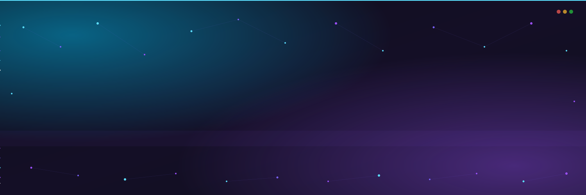

<!-- ╔══════════════════════════════════════════════════════════════════╗ -->
<!-- ║                       STEPHEN SOOKRA · README                    ║ -->
<!-- ║       AI/ML · XR Dojo · Hackathon Builder · Future Founder       ║ -->
<!-- ╚══════════════════════════════════════════════════════════════════╝ -->

<!-- ─────────────────────────  HERO BANNER  ───────────────────────── -->
<!-- Hand-coded animated SVG: drifting particles, breathing glow, gradient wipe, typewriter subtitle, neural-net constellation -->
<a href="https://github.com/StephenSook">
  
</a>

<!-- ─────────────────────  ANIMATED TYPING TAGLINE  ───────────────── -->
<div align="center">
  <a href="https://stephensookra.com">
    
  </a>
</div>

<!-- ─────────────────────────  STATUS BADGES  ─────────────────────── -->
<div align="center">
  
  
  <a href="https://stephensookra.com"></a>
</div>

<!-- ──────────────────────────  RECORD STRIP  ─────────────────────── -->
<div align="center">
  
  
  
  
</div>

<p align="center">
  <sub><a href="#about"><b>About</b></a> &nbsp;·&nbsp; <a href="#work"><b>Featured Builds</b></a> &nbsp;·&nbsp; <a href="#stack"><b>Tech Stack</b></a> &nbsp;·&nbsp; <a href="#stats"><b>Stats</b></a> &nbsp;·&nbsp; <a href="#resume"><b>Resume</b></a> &nbsp;·&nbsp; <a href="#connect"><b>Connect</b></a></sub>
</p>

<br/>

<!-- ════════════════════════  DIVIDER  ════════════════════════ -->


<!-- ───────────────────────────  ABOUT  ────────────────────────────── -->
<div id="about"></div>

<div id="user-content-toc">
  <ul align="center" style="list-style: none;">
    <summary>
      <h2 style="display: inline-block;">About Me</h2>
    </summary>
  </ul>
</div>

```yaml
name:       Stephen Sookra
role:       Software Engineer Intern @ XR Dojo
education:  Kennesaw State University · CS · AI/ML Concentration · 3.8 GPA · '28
record:     17 hackathon awards across 15 events
latest:     $5,000 Visa track · HackGT 13 (Lullabuy, Sep 2026)
building:   ATL Quest (AR @ XR Dojo) · Nest (foster-youth navigator)
learning:   Trustworthy AI · Multi-Agent Governance · LLM Inference on Arm · On-Device Models
mentors:    Aaron Butler · Henry
mission:    Founding a company in trustworthy AI for high-stakes domains
location:   Atlanta, GA  (UTC-5)
contact:    stephensookra@gmail.com  ·  stephensookra.com
```

- **Latest win** &nbsp;**$5,000 Visa track** at **HackGT 13** with **Lullabuy**: a used-baby-gear checkout that holds the Visa payment until a phone photo of the label clears every CPSC and NHTSA recall, built with Tylin Delaney
- **Recent wins** &nbsp;**1st place + $2,000** for **Upstander** at BIT Atlanta Code for Change · **Best Use of Technology** for **Manifest** at the IBM AI Builders Challenge · **1st of 238 + $5,000** for **Aloud** at the YouCam API Hackathon · **2nd** at the Modiqo Rote Playoffs
- **Up next** &nbsp;**Cal Hacks 13.0** in San Francisco (Oct 2026)
- **Giving back** &nbsp;**GDG on Campus KSU** e-board (mentorship) · helping first-time hackers ship
- **Summer 2026** &nbsp;taught web + game dev as a **SMASH Academy TA** (Morehouse / Spelman)
- **Ask me about** &nbsp;hackathons · AR/XR · AI/ML · founding · Atlanta tech scene

<br/>

<!-- ════════════════════════  DIVIDER  ════════════════════════ -->


<!-- ─────────────────────────  FEATURED BUILDS  ─────────────────────── -->
<div id="work"></div>

<div id="user-content-toc">
  <ul align="center" style="list-style: none;">
    <summary>
      <h2 style="display: inline-block;">Featured Builds</h2>
    </summary>
  </ul>
</div>

<p align="center">
  <sub><b>Hackathon record · 17 awards across 15 events</b> &nbsp;·&nbsp; 🏆 $5,000 Visa track @ HackGT 13 &nbsp;·&nbsp; 🥇 1st of 238 + $5,000 @ YouCam API &nbsp;·&nbsp; 🏆 $5,000 Grand Prize @ IBM SkillsBuild &nbsp;·&nbsp; 🥇 1st + $2,000 @ BIT Code for Change &nbsp;·&nbsp; 🏆 Best Use of Technology @ IBM AI Builders Aug &nbsp;·&nbsp; 🏆 Most Innovative @ IBM AI Builders July &nbsp;·&nbsp; 💡 Most Innovative @ IBM SkillsBuild June &nbsp;·&nbsp; 🏆 Best Use of Gemma 4 @ Hack RenderATL &nbsp;·&nbsp; 🥇 1st @ ToC Chaos Challenge &nbsp;·&nbsp; 🥇 1st of 22 @ Actian &nbsp;·&nbsp; 🥇 1st @ HMI 2026 &nbsp;·&nbsp; 🥈 2nd of 4,700+ @ Wells Fargo / GCA &nbsp;·&nbsp; 🥈 2nd @ Rote Playoffs &nbsp;·&nbsp; 🥈 2nd + 🥉 3rd @ KSU Social Good &nbsp;·&nbsp; 🥉 3rd @ KSU FinTech &nbsp;·&nbsp; 🥉 3rd @ Vibra ATL</sub>
</p>

<table align="center">
  <tr>
    <td valign="top" width="50%">
      🏆 <a href="https://github.com/StephenSook/secondhand-safe"><b>Lullabuy</b></a> &nbsp;<sub>$5,000 Visa track · HackGT 13</sub><br/>
      Holds a buyer's Visa payment until a phone photo of used baby gear's label clears 1,207 CPSC and NHTSA recalls: reversed on a recall, captured when clean. <a href="https://lullabuy.tech">Live</a><br/>
      <sub>Next.js · Visa Acceptance · CLIP · MongoDB Atlas · Expo</sub>
    </td>
    <td valign="top" width="50%">
      🥇 <a href="https://github.com/StephenSook/aloud"><b>Aloud</b></a> &nbsp;<sub>1st of 238 + $5,000 · YouCam API</sub><br/>
      Voice-first skincare assistant a blind shopper uses alone with the screen off. Every spoken skin read traces to a YouCam analysis score. <a href="https://aloudbeauty.vercel.app">Live</a><br/>
      <sub>Next.js · OpenAI Realtime · YouCam API · MediaPipe · Capacitor</sub>
    </td>
  </tr>
  <tr>
    <td valign="top" width="50%">
      🏆 <a href="https://github.com/StephenSook/varsity"><b>VARSITY</b></a> &nbsp;<sub>$5,000 Grand Prize + Most Innovative · IBM SkillsBuild</sub><br/>
      Screen-reader-native AI that explains VAR and offside calls to blind football fans, grounded in the IFAB Laws. <a href="https://web-chi-wine-13.vercel.app">Live</a><br/>
      <sub>Python · IBM Granite · RAG · a11y</sub>
    </td>
    <td valign="top" width="50%">
      🥇 <a href="https://github.com/StephenSook/upstander"><b>Upstander</b></a> &nbsp;<sub>1st + $2,000 · BIT Atlanta Code for Change</sub><br/>
      Foundry agent that spots group-chat pile-ons across messages and gets the targeted kid a trusted adult, including a consent-gated real phone call.<br/>
      <sub>Azure AI Foundry · MCP · Content Safety · FastAPI</sub>
    </td>
  </tr>
  <tr>
    <td valign="top" width="50%">
      🏆 <a href="https://github.com/StephenSook/manifest"><b>Manifest</b></a> &nbsp;<sub>Best Use of Technology · IBM AI Builders</sub><br/>
      Regulatory critical-path planner for university CubeSats, where live space weather can change an orbital-compliance verdict.<br/>
      <sub>Next.js · IBM Bob · watsonx Granite · NOAA</sub>
    </td>
    <td valign="top" width="50%">
      🏆 <a href="https://github.com/StephenSook/accessgate"><b>AccessGate</b></a> &nbsp;<sub>Most Innovative · IBM AI Builders July</sub><br/>
      Caption + audio-description conformance pre-check for film: 23 cited rules with a gated generative fix on IBM Granite.<br/>
      <sub>Python · IBM watsonx · React · a11y</sub>
    </td>
  </tr>
  <tr>
    <td valign="top" width="50%">
      🥇 <a href="https://github.com/StephenSook/trace-forensic-search"><b>Trace</b></a> &nbsp;<sub>1st of 22 · Actian Build Challenge</sub><br/>
      Semantic search bridging how families describe a missing person and how forensic records word it, across 40,000+ NamUs records.<br/>
      <sub>Python · SapBERT · Actian VectorAI · FastAPI</sub>
    </td>
    <td valign="top" width="50%">
      🏆 <a href="https://github.com/StephenSook/throughline"><b>Throughline</b></a> &nbsp;<sub>Best Use of Gemma 4 · Hack RenderATL</sub><br/>
      Record-integrity layer: reconciles what one institution asserts against independent authorities, 51.9% divergence across 1,344 entities.<br/>
      <sub>Python · Gemma 4 · FastAPI · React</sub>
    </td>
  </tr>
  <tr>
    <td valign="top" width="50%">
      🥇 <a href="https://github.com/StephenSook/StepSafe"><b>StepSafe</b></a> &nbsp;<sub>1st · HMI 2026</sub><br/>
      Diabetic foot ulcer severity from a single photo, using a fine-tuned MobileNetV2 trained on ~20,000 images. <a href="https://stepsafe-web.vercel.app">Live</a><br/>
      <sub>TensorFlow · MobileNetV2 · FastAPI · React</sub>
    </td>
    <td valign="top" width="50%">
      🥈🥉 <a href="https://github.com/StephenSook/PyroLens"><b>PyroLens</b></a> &nbsp;<sub>2nd + 3rd · KSU Social Good</sub><br/>
      Prescribed-burn decision support fusing ESP32 field sensors, NOAA weather, and satellite data for safer controlled burns.<br/>
      <sub>Python · scikit-learn · ESP32 · Supabase</sub>
    </td>
  </tr>
</table>

<p align="center"><sub><b>Also shipped</b> &nbsp;·&nbsp; <a href="https://github.com/StephenSook/Parliament-Quickbuild">Parliament</a> (1st, one-hour build) &nbsp;·&nbsp; <a href="https://github.com/StephenSook/erasure-proof">Erasure-Proof</a> (provable crypto-erasure for agent memory) &nbsp;·&nbsp; <a href="https://github.com/StephenSook/curtail">Curtail</a> (governed agent fleet for California water law) &nbsp;·&nbsp; <a href="https://github.com/StephenSook/renova">Renova</a> (offline Medicaid renewal helper) &nbsp;·&nbsp; <a href="https://github.com/StephenSook/gravitonkv">GravitonKV</a> (KV-cache quantization on Graviton4)</sub></p>

<p align="center"><sub>More on <a href="https://devpost.com/stephensookra">DevPost</a> &nbsp;·&nbsp; <a href="https://stephensookra.com">stephensookra.com</a></sub></p>

<br/>

<!-- ════════════════════════  DIVIDER  ════════════════════════ -->


<!-- ───────────────────────────  TECH STACK  ───────────────────────── -->
<div id="stack"></div>

<div id="user-content-toc">
  <ul align="center" style="list-style: none;">
    <summary>
      <h2 style="display: inline-block;">Tech Stack</h2>
    </summary>
  </ul>
</div>

<table align="center" width="100%">
<tr>
<td align="center"><b>AI / ML</b></td>
<td align="center">
  
  
  
  
  
</td>
</tr>
<tr>
<td align="center"><b>Languages</b></td>
<td align="center">
  
</td>
</tr>
<tr>
<td align="center"><b>Web / Mobile</b></td>
<td align="center">
  <br/>
  
  
  
  
</td>
</tr>
<tr>
<td align="center"><b>Data / Cloud</b></td>
<td align="center">
  
</td>
</tr>
<tr>
<td align="center"><b>Tools</b></td>
<td align="center">
  
  
  
</td>
</tr>
</table>

<br/>

<!-- ════════════════════════  DIVIDER  ════════════════════════ -->


<!-- ──────────────────────────  GITHUB STATS  ─────────────────────── -->
<div id="stats"></div>

<div id="user-content-toc">
  <ul align="center" style="list-style: none;">
    <summary>
      <h2 style="display: inline-block;">GitHub Stats</h2>
    </summary>
  </ul>
</div>

<!-- top-langs card dropped 2026-07-03: github-readme-stats.vercel.app shared instance returns 503 (rate-limited). Re-add only via a self-hosted instance. -->
<div align="center">
  
</div>

<br/>

<!-- ════════════════════════  DIVIDER  ════════════════════════ -->


<!-- ─────────────────────  ACTIVITY GRAPH  ─────────────────────────── -->

<div id="user-content-toc">
  <ul align="center" style="list-style: none;">
    <summary>
      <h2 style="display: inline-block;">Contribution Activity</h2>
    </summary>
  </ul>
</div>

<div align="center">
  
</div>

<br/>

<!-- ════════════════════════  DIVIDER  ════════════════════════ -->


<!-- ────────────────────────  SNAKE ANIMATION  ─────────────────────── -->

<div id="user-content-toc">
  <ul align="center" style="list-style: none;">
    <summary>
      <h2 style="display: inline-block;">Watch My Contributions Get Eaten</h2>
    </summary>
  </ul>
</div>

<div align="center">
  <picture>
    <source media="(prefers-color-scheme: dark)" srcset="https://raw.githubusercontent.com/StephenSook/StephenSook/output/github-snake-dark.svg" />
    <source media="(prefers-color-scheme: light)" srcset="https://raw.githubusercontent.com/StephenSook/StephenSook/output/github-snake.svg" />
    
  </picture>
</div>

<br/>

<!-- ════════════════════════  DIVIDER  ════════════════════════ -->


<!-- ───────────────────────  SPOTIFY NOW PLAYING  ──────────────────── -->

<div id="user-content-toc">
  <ul align="center" style="list-style: none;">
    <summary>
      <h2 style="display: inline-block;">Now Playing</h2>
    </summary>
  </ul>
</div>

<!-- Live widget: novatorem deployed at stephensook-novatorem.vercel.app -->
<div align="center">
  <a href="https://open.spotify.com/user/31ozwwqttjufzxrv7k3qoovvpd34">
    
  </a>
  <br/><br/>
  <a href="https://open.spotify.com/user/31ozwwqttjufzxrv7k3qoovvpd34">
    
  </a>
</div>

<br/>

<!-- ════════════════════════  DIVIDER  ════════════════════════ -->


<!-- ─────────────────────────  RESUME CTA  ──────────────────────────── -->
<div id="resume"></div>

<div id="user-content-toc">
  <ul align="center" style="list-style: none;">
    <summary>
      <h2 style="display: inline-block;">Resume</h2>
    </summary>
  </ul>
</div>

<div align="center">
  <a href="./assets/Stephen_Sookra_Resume.pdf">
    
  </a>
  &nbsp;
  <a href="https://stephensookra.com">
    
  </a>
</div>

<br/>

<!-- ════════════════════════  DIVIDER  ════════════════════════ -->


<!-- ─────────────────────────  CONNECT  ────────────────────────────── -->
<div id="connect"></div>

<div id="user-content-toc">
  <ul align="center" style="list-style: none;">
    <summary>
      <h2 style="display: inline-block;">Let's Connect</h2>
    </summary>
  </ul>
</div>

<div align="center">
  <a href="https://www.linkedin.com/in/stephen-sookra-633682339/"></a>
  <a href="https://x.com/steve_social_"></a>
  <a href="https://www.instagram.com/sociaall_/"></a>
  <a href="https://www.youtube.com/@stephensookra3736"></a>
  <a href="https://devpost.com/stephensookra"></a>
  <a href="mailto:stephensookra@gmail.com"></a>
  <a href="https://stephensookra.com"></a>
</div>

<br/>

<!-- ════════════════════════  DIVIDER  ════════════════════════ -->


<!-- ────────────────────  RANDOM DEV QUOTE  ─────────────────────────── -->

<div align="center">
  
</div>

<br/>

<!-- ─────────────────────────  FOOTER WAVE  ─────────────────────────── -->


<div align="center">
  <sub>
    <b>Credit</b>: Inspired by <a href="https://github.com/tylinndd"><b>@tylinndd</b></a> · originally adapted from <a href="https://github.com/1010nishant"><b>@1010nishant</b></a><br/>
    Built by <a href="https://github.com/StephenSook"><b>Stephen Sookra</b></a> · Atlanta, GA · <i>shipping ambitious things</i><br/>
    <sub>Last edited: October 2026</sub>
  </sub>
</div>
